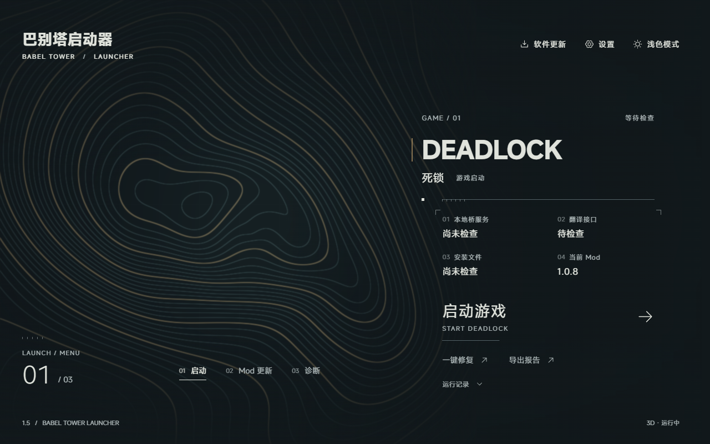

# BabelTowerLauncher — 巴别塔启动器

用于 [Babel Tower](https://github.com/c1375rick/BabelTower) Deadlock 聊天翻译 Mod 的 Windows 可视化启动与更新管理器。启动器独立维护，Mod 本体由原作者维护。

当前启动器版本 **1.5**；启动器版本与 Mod 版本相互独立。



## 功能

- 自动检测 Steam 游戏库、Deadlock 目录和巴别塔安装目录。
- 启动桥，检查本地服务、翻译接口及 Mod 加载配置，通过后确认启动游戏。
- 从官方 GitHub 下载完整 Mod 包，或选择、拖入 ZIP / 7Z / RAR；整包替换，更新游戏 VPK。
- 游戏运行时只下载 Mod 更新，退出游戏后再确认安装。
- 从启动器 GitHub 仓库下载软件更新，校验后自动退出、替换并重新打开，保留个人配置。
- 每次打开后台检查 Mod 和启动器版本；有新版弹窗选择更新或稍后。
- 右上角切换深色 / 浅色主题，并记住选择。
- 提供诊断、桥重启与重新检查。
- 一键修复缺失或不一致的巴别塔 VPK、addons 加载项与桥日志配置。保留其他 Mod 和接口配置，变更前保存备份。
- 导出诊断报告：先预览，再选择保存位置；不包含配置原文、密钥、聊天日志与完整本地路径。
- 实验室等高线动态背景：地形缓慢起伏，鼠标附近产生柔和波纹；动效默认开启，支持深浅色主题，刷新上限 60 fps，窗口隐藏时暂停绘制。保留莱茵界面与 MiSans 字体。

## 使用

1. 从 [Releases](https://github.com/alloywr147/BabelTowerLauncher/releases) 下载 **BabelTowerLauncher-1.5-win64.zip**。
2. 完整解压，运行 **巴别塔启动器.exe**；首次打开确认检测到的路径。
3. 未安装 Mod 时，从“更新”页下载原作者的 Windows 完整包，或手动导入。
4. 点击“检查并启动游戏”，检查通过后确认启动。

本压缩包不含 Mod 本体、个人配置或 API Key。桥与翻译接口检查通过后，仍需在游戏中确认实际翻译效果。

需要 Windows x64、.NET Framework 4.8 和 [Microsoft Edge WebView2 Runtime](https://developer.microsoft.com/microsoft-edge/webview2/)。现代 Windows 通常已安装 Runtime；缺少时提示使用微软官方安装程序。请保留 assets 和 tools 文件夹。

游戏运行期间，一键修复仅允许重启已选桥；需要修改游戏文件时会要求退出游戏。源完整包缺失时，需在 Mod 更新页重新下载或导入。

## 构建与测试

Windows x64、.NET Framework 4.8 自带 C# 编译器；界面使用 React / Three.js / Vite，需 Node.js 22 与 npm。WebView2 SDK 固定为 1.0.4258.31。

```powershell
powershell -NoProfile -ExecutionPolicy Bypass -File scripts\restore-webview.ps1
cd web
npm ci
npm test
npm run build
cd ..
powershell -NoProfile -ExecutionPolicy Bypass -File scripts\build.ps1
powershell -NoProfile -ExecutionPolicy Bypass -File scripts\test.ps1
powershell -NoProfile -ExecutionPolicy Bypass -File scripts\test-webhost.ps1
```

构建产物在 `dist/BabelTowerLauncher-1.5/`，测试产物在 `artifacts/`。测试使用临时目录、模拟接口和屏幕外窗口，不启动真实游戏或桥。原生 WebView2 测试需要本机安装 Runtime。

## 文档与许可

- [详细使用说明](docs/ONLINE_UPDATES.md)
- [已知限制](docs/KNOWN_ISSUES.md)
- [构建与验证说明](docs/IMPLEMENTATION_NOTES.md)
- [GitHub 发布步骤](docs/GITHUB_UPLOAD.md)
- [第三方组件](docs/THIRD_PARTY.md)

启动器源码采用 [MIT](LICENSE)，随附 7-Zip 的许可与对应源码见 tools 目录。Mod 许可由原项目负责。RhineLabUI 的 MIT 许可、WebView2、字体及其他依赖说明见 [第三方组件](docs/THIRD_PARTY.md)。本项目使用 AI 辅助编写与调试。
